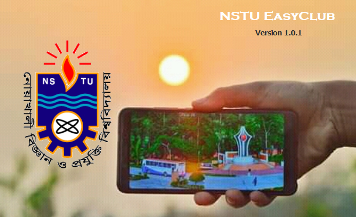
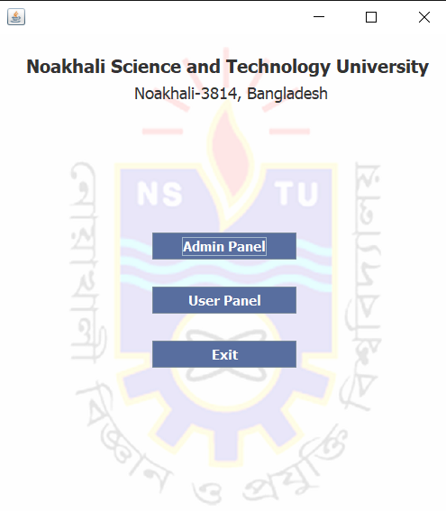
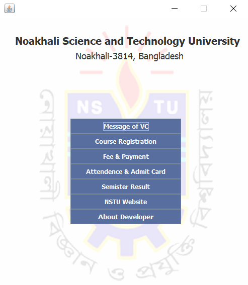
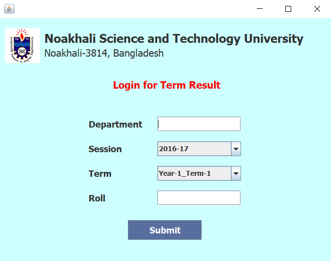
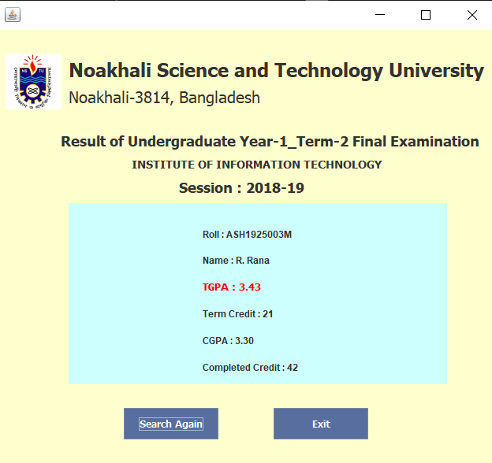

# NSTU-EasyClub


## Overview
Day by day university authorities all over the world are concering about
administrative and academic activities immensely as well as managing and providing
a better academic experience to students effectively. However, maintaining and
keeping track of university administrative activities is not an easy process in the fast-
growing world. It requires hard work and often it is time consuming.
**NSTU EASYCLUB** will play an essential role in the current edutional system of
Noakhali Science and Technology University. Hopefully This application will be
helpful through avoiding hand writing and manual paper (in many cases).
## Title
```
Project Title : NSTU EASYCLUB
Project Type : University Management System
```
## Why NSTU EASYCLUB
It’s a software which basically used for paying all kinds bill of Fees, publishing
(Admin) or getting (Student) Semester Result, downloading Course Registration
form, Attendence Report, Admit Card etc.
```
View details on _User Manual.pdf_ file
```
### Start Window

### User Panel

### Login for Result

### Semester Result

